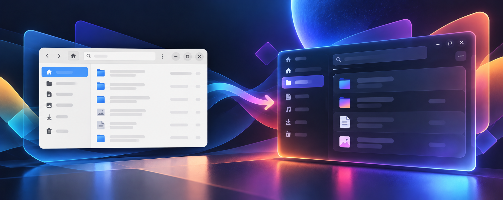

# libcosmic-gtk-appearance

Makes GTK applications follow the COSMIC desktop's appearance settings.



## What it does

COSMIC can frost the background behind a window, and its own applications use
it. GTK applications never do: neither libgtk nor libadwaita asks the
compositor for the effect, and both paint an opaque background.

This is a small shared library that loads into GTK3 and GTK4 applications. It
reads your COSMIC appearance settings and applies them: frosted glass when it is
enabled, the palette of the live theme, and COSMIC's own colours, corner radius
and spacing on the window decorations. Change the theme, the accent colour, the
density or the frosted setting and open windows follow along.

It follows the configuration rather than imposing a look. Turn frosted glass off
and windows stay solid; where the blur is out of reach — an X11 window, a
compositor that does not offer the effect — the application opens exactly as it
would without the library.

## Installing

```sh
just setup
```

That builds the library and installs it: the system copy for native
applications, a second one where sandboxes can reach it, the grant that hands it
to flatpaks, and the session setting that lets it drive the blur. GTK 4.23.3 and
newer claim the blur protocol themselves, and the region they set lands a shadow
margin off under COSMIC, so `GDK_WAYLAND_DISABLE` keeps GTK out of the way. The
system step asks for sudo; the rest runs as you.

The library installs as a GIO module, which every GTK application scans on
startup, so there is nothing to configure afterwards. Applications pick it up
the next time they start — flatpaks included, even ones installed next month —
and the ones your session starts from your next login.

```sh
just uninstall
```

takes all of it back, exactly: nothing is left pointing at a file that no longer
exists. Every step is also available on its own, and all of them can be repeated
safely:

| recipe | does |
| --- | --- |
| `just install` | the system copy, for native applications |
| `just install-user` | the copy flatpaks can reach |
| `just flatpak-enable` | grants that copy to every flatpak |
| `just flatpak-disable` | takes the grant back |
| `just session-enable` | hands the blur protocol to the library |
| `just check` | rustfmt, clippy and the tests |
| `just deb` | builds a package |

## Settings

| variable | effect |
| --- | --- |
| `COSMIC_GTK_APPEARANCE_DEBUG=1` | log every step to stderr |
| `COSMIC_GTK_APPEARANCE_ALPHA=0.78` | force frosted glass at that opacity |
| `COSMIC_GTK_APPEARANCE_CSS_EXTRA=f.css` | append rules to the stylesheet |
| `COSMIC_GTK_APPEARANCE_CSS=f.css` | replace the stylesheet |
| `COSMIC_GTK_APPEARANCE_NO_CSS=1` | blur only, leave styling alone |
| `COSMIC_GTK_APPEARANCE_DISABLE=1` | turn the library off for that process |

`./try.sh <app>` runs something with logging on, and `./try.sh --content <app>`
adds the stylesheets from `examples/`, which also let the blur through text
views. For a flatpak, pass the variable through the sandbox:
`flatpak run --env=COSMIC_GTK_APPEARANCE_DEBUG=1 <id>`.

## Limits

- An application that paints its own window background wins, because GTK
  flattens every layer before the compositor sees it. GTK is only the frame for
  Gecko and for Chromium, so Firefox, Thunderbird and Electron applications stay
  solid: the blur is attached and the stylesheet is loaded, and neither reaches
  the pixels.
- Popovers, menus and tooltips are separate surfaces and stay opaque on purpose,
  and so is anything drawn into a `picture`, so an image shows against a solid
  background rather than against the desktop.
- X11 and XWayland windows get the colours and the decorations, never the blur.
- Only the `gtk.css` COSMIC generates is followed; a hand-written one is left
  alone, and its colours reach a window once, when it opens.
- A window that is not a GTK window is not touched at all.

## Licence

LGPL-3.0-or-later. The library is loaded into the address space of other
programs, including proprietary ones; the LGPL keeps the copyleft on this code
without reaching into whatever it ends up next to. `LICENSE` holds the LGPL-3
text, which incorporates by reference the GPL-3 in `LICENSE.GPL-3`.
